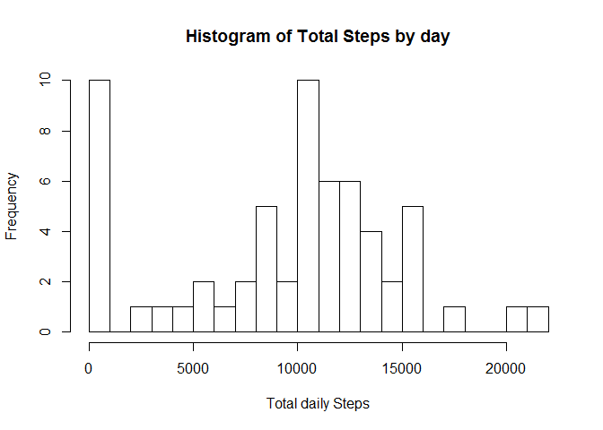
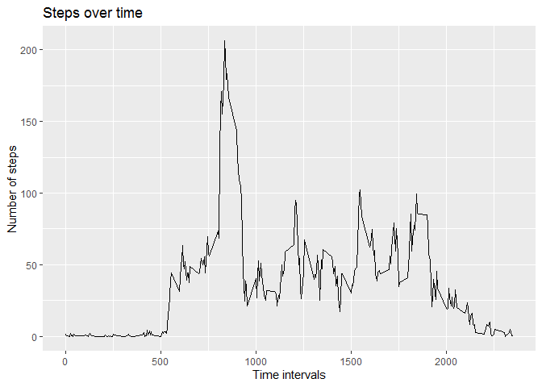
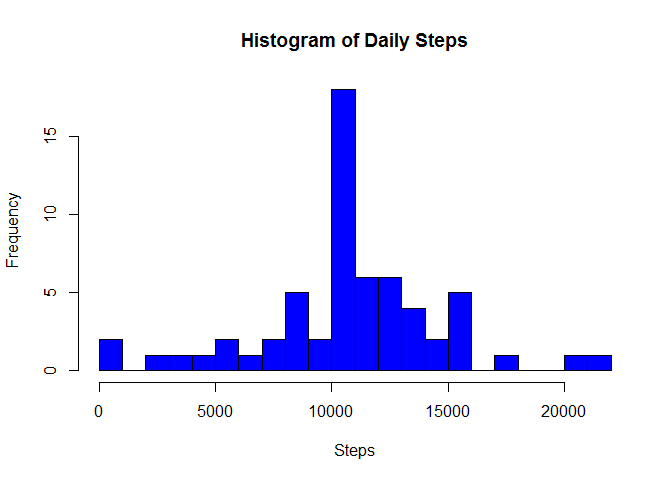
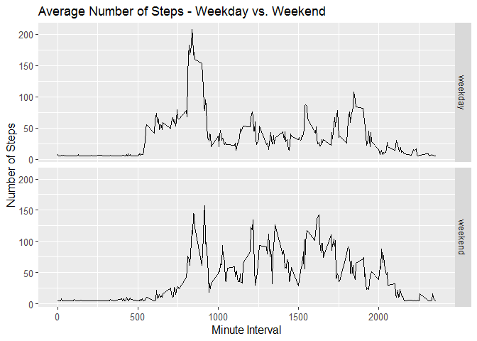

Jakob Larsen  
03.04.2022

## Loading packages
The packages must be installed prior to running the code


```r
library(ggplot2)
library(dplyr)
library(Hmisc)
library(lubridate)
```

## 1. Reading and preprocessing data
The data source file must be found in  the working directory. I check if the source file is unzipped and if it is not - I unzip it and load the data. 


```r
  if (!file.exists("activity.csv") ) {
  unzip("activity.zip")
}
activitydata<- read.csv("activity.csv", header = TRUE)
activitydata$date<-as.Date(activitydata$date)
```

## 2. What is mean total number of steps taken per day?

Start by calculating the total number of step per day ignoring missing values and plot total number os steps a day

```r
databydate <- activitydata  %>% group_by(date) %>% summarise(tsteps = sum(steps, na.rm=TRUE))
hist(databydate$tsteps, xlab = "Total daily Steps",main="Histogram of Total Steps by day", breaks = 30)
```

<!-- -->

Calculating mean and median of the total number of steps taken per day

```r
 print(paste0("Mean: ", mean(databydate$tsteps)))
```

```
## [1] "Mean: 9354.22950819672"
```

```r
 print(paste0("Median: ", median(databydate$tsteps)))
```

```
## [1] "Median: 10395"
```

## 3. What is the average daily activity pattern?

Times series plot of of the 5-minute interval and the average number of steps taken, averaged across all days


```r
databyinterval <- activitydata%>% select(interval, steps) %>% group_by(interval) %>% summarise(tsteps= mean(steps,na.rm=TRUE)) 

ggplot(databyinterval, aes(x=interval, y=tsteps))+ geom_line() + 
  ggtitle("Steps over time") +labs(x="Time intervals")+labs(y="Number of steps")
```

<!-- -->

Finding the 5-minute interval that, on average, contains the maximum number of steps

```r
res<-databyinterval$interval[which.max(databyinterval$tsteps)]
print(paste0("Interval wih the most steps on average: ",res))
```

```
## [1] "Interval wih the most steps on average: 835"
```

## 4. Imputing missing values

Calculate and report the total number of missing values in the dataset


```r
NoNa <- length(which(is.na(activitydata$steps)))
print(paste0("Number of missing values: ",NoNa))
```

```
## [1] "Number of missing values: 2304"
```

1. Devise a strategy for filling in all of the missing values in the dataset

2. For replacing missing values I use the function Impute from the Hmisc package. The function lets you replace missing values by e.g. the mean. 

3. Create a new dataset that is equal to the original dataset but with the missing data filled in.


```r
newactivitydata<-activitydata
newactivitydata$steps<-impute(activitydata$steps,fun=mean)
```
4. Histogram of the total number of steps taken each day and the mean and median total number of steps taken per day.


```r
stepsPerDay <- newactivitydata %>%
  group_by(date) %>%
  summarise(sumsteps = sum(steps, na.rm = TRUE)) 

hist(stepsPerDay$sumsteps, main = "Histogram of Daily Steps", 
     col="blue", xlab="Steps",breaks=30)
```

<!-- -->

```r
newmean <- round(mean(stepsPerDay$sumsteps),digits=0)
print(paste0("Mean with NAs handled: ",newmean))
```

```
## [1] "Mean with NAs handled: 10766"
```

```r
newmedian <- round(median(stepsPerDay$sumsteps),digits=0)
print(paste0("Median with NAs handled: ",newmedian))
```

```
## [1] "Median with NAs handled: 10766"
```
The mean and median both increase with NA replaced by mean and the correspond to each other, so the distribution becomes more symmetrical.

## 5. Are there differences in activity patterns between weekdays and weekends?
1 Create a new factor variable in the dataset with two levels - "weekday" and "weekend" indicating whether a given date is a weekday or weekend day.  
I use the dataset without NAs. I use the package Lubridate to determine the day of the week


```r
newactivitydata$date<-as.Date(newactivitydata$date)
newactivitydata$Dayofweek<-ifelse(wday(newactivitydata$date,week_start=1) %in% c(6, 7), "weekend", "weekday")
newactivitydata$Dayofweek<-as.factor(newactivitydata$Dayofweek)

weekdaydf<-filter(newactivitydata,newactivitydata$Dayofweek=="weekday")
weekenddf<-filter(newactivitydata,newactivitydata$Dayofweek=="weekend")

weekdaydf<-weekdaydf %>% group_by(interval) %>% summarise(steps=mean(steps))
weekdaydf$day<-"weekday"

weekenddf<-weekenddf %>% group_by(interval) %>% summarise(steps=mean(steps))
weekenddf$day<-"weekend"

finaldf<-rbind(weekdaydf,weekenddf)
finaldf$day<-as.factor(finaldf$day)
```
Plot containing a time series plot  of the 5-minute interval  and the average number of steps taken, averaged across all weekday days or weekend days .

```r
g <- ggplot (finaldf, aes (interval, steps))
g + geom_line() + facet_grid (day~.) + 
  theme(axis.text = element_text(size = 10),axis.title = element_text(size = 12)) + 
  labs(y = "Number of Steps") + labs(x = "Minute Interval") + 
  ggtitle("Average Number of Steps - Weekday vs. Weekend") 
```

<!-- -->
